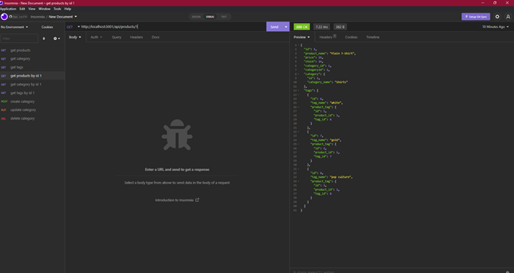

# Employee-Tracker

## Descrpition 
This application is a mockup E-Commerce backend database. It stores information such as products, product tags, and product categories. Using Insomnia I can test the api by getting, posting, putting, and deleting the data.

## Installation
* link to walkthrough video: https://youtu.be/MkBUQdd48jU
* link to GitHub: https://github.com/ckrum21/E-Commerce-Back-End

Install this website by cloning the code to your local devices.

software required to download this website:
* GitBash or other terminal
* Visual Studio Code

## Usage

The code used for this webpage is HTML, CSS, JavaScript, Node, sequelize and mySQL.

## Credits
Chelsea Krum 